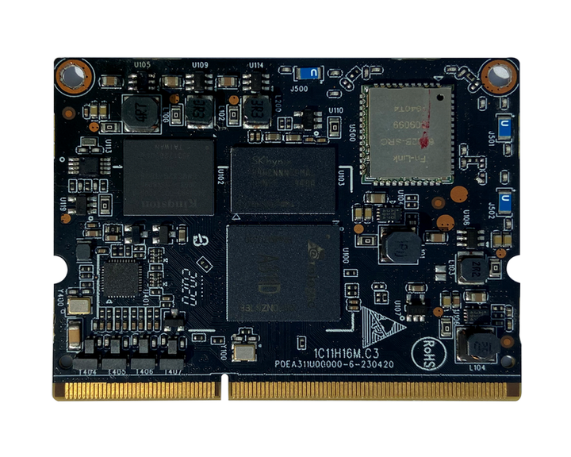
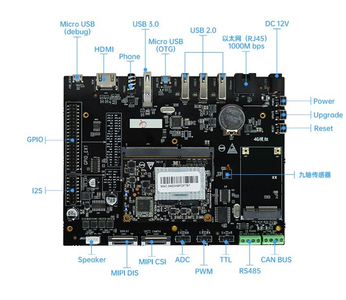

# 【开发板名称】九联Unionpi-Tiger开发套件

**简介**

九联Unionpi-Tiger是一款应用于图像处理，音视频处理和深度学习等的智能硬件。其芯片基于Amlogic A311D，拥有强大的CPU、GPU和神经网络加速子系统。支持4K视频编解码器引擎和一流的HDR图像处理，集成了所有标准音频/视频输入/输出接口，主系统CPU采用大小核设计，主频高达2.2GHz，集成了四个Cortex-A73核心和两个Cortex-A53核心 ，集成独立的5.0T NPU处理器。

九联Unionpi-Tiger开发板外观图如图1所示：


图1：九联Unionpi-Tiger开发板外观图

**一、开发板详情**

**1、九联Unionpi-Tiger开发板核心板正面外观图**

****

图2：九联Unionpi-Tiger开发板核心板正面外观图

**3、接口复用说明**

**·** USB OTG：目前USB OTG默认供HDC调试使用，和3 x USB 2.0接口不能同时使用，需要进行切换，切换可参考以下命令。

```shell
# 切换USB HUB (ttyACM0 ttyACM1)
echo 1 > /sys/devices/platform/leds/leds/usb_switch/brightness
echo 0 >  /sys/devices/platform/soc/ffe09000.usb/usb_mode
echo host > /sys/class/usb_role/ffe09000.usb-role-switch/role
```

**二、开发板规格**

Amlogic A311D采用四个Cortex-A73，主频最高为2.2GHz的大核和两个Cortex-A53，主频最高为1.8GHz的小核组成；采用22nm先进工艺，具有低功耗高性能的特点，可广泛应用于嵌入式人工智能领域。

九联Unionpi-Tiger开发板处理器规格及规格清单如表1所示：

<table>
   <tr>
        <td rowspan="2">芯片</td> 
        <td>Amlogic A311D 芯片</td> 
   </tr>
   <tr>
        <td >Quad-core Cortex-A73 + Dual-core Cortex-A53</td>  
    </tr>
   <tr>
        <td>架构</td> 
        <td>ARM</td> 
   </tr>
    <tr>
        <td>主频</td> 
        <td>Quad-core Cortex-A73@2.2GHz Dual-core Cortex-A53@1.8GHz</td> 
   </tr>
    <tr>
        <td>工作电压</td> 
        <td>12V/3A</td> 
   </tr>
    <tr>
        <td>内存&存储</td> 
        <td>4GB LPDRR4、 32GB EMMC 5.1</td> 
   </tr>
   <tr>
        <td rowspan="5">通用规格</td>    
        <td >支持OpenHarmony、Linux系统</td>  
    </tr>
    <tr>
        <td >千兆网口：可通过网口访问和传输内外网的数据，提高网络传输效率</td>  
    </tr>
    <tr>
        <td >核心板尺寸 67.6mm x 52.3mm，可满足小型终端产品空间需求</td>  
    </tr>
    <tr>
        <td >丰富的扩展接口，支持多种视频输入输出接口（详见底板规格说明）</td>  
    </tr>
</table>

表1 九联Unionpi-Tiger开发板处理器规格及规格清单

九联Unionpi-Tiger开发板底板规则说明如表2所示：

| **Unionpi-Tiger底板规格说明** |                                                                                  |
| ----------------------- | -------------------------------------------------------------------------------- |
| 显示接口                    | 1 x HDMI 2.0 , 支持 4K@60HZ 输出 和 HDCP 1.4/2.2、  1 x MIPI-DSI , 支持单通道1080P@60fps 输出 |
| 音频接口                    | 1 x HDMI 2.0 音频输出 、1 xSpeaker 双声道（4Ω/5W）、1 x 四段式CTIA耳麦，支持麦克风音频输入                 |
| 以太网                     | 1000 Mbps以太网接口（RJ45）                                                             |
| 无线网络                    | SDIO接口，支持WIFI 5G/2.4G,BT5.0                                                      |
| 摄像头接口                   | 1 x 2-lane MIPI-CSI 摄像头接口                                                        |
| GPU                     | ARM Mali-G52 4核GPU                                                               |
| USB                     | 3 x USB2.0 Hub、1 x USB3.0、1xMicro-USB(OTG)                                       |
| SDMMC                   | 1x Micro SD Card3.0                                                              |
| 按键                      | 1x Power 1x Update 1x Reset                                                      |
| 调试                      | 1x 调试串口(USB转串口)                                                                  |
| RTC                     | 1x RTC                                                                           |
| MPU                     | 1xICM20948 （以实际板载为准）                                                             |
| 扩展接口                    | RS485 x 1、CAN Bus x 1、ADC x 2、PWM x 2、TTL x 1、GPIO 40Pin                         |
| 底板尺寸                    | 180mm×130mm                                                                      |

表2 九联Unionpi-Tiger开发板底板规则说明

**三、开发板功能**

**·** 核心板: 采用DDR3 SODIMM接口，尺寸为67.6mm x 52.3mm，可满足小型终端产品空间需求

· 千兆网口：可通过千兆以太网网口(RJ45)访问和传输内外网数据，提高网络传输效率

· 内置神经网处理器 NPU:  AI 运算支持 8bit/16bit 运算，运算性能高达5.0TOPS,支持主流神经网络模型（Caffe/MXNet/TensorFlow/TF-lite/ONNX/Darknet等）

·视频处理器VPU：支持4K VP9，H265，H264视频解码，高达60fps，支持多路1080P 多格式解码（H265，H264，MPEG-1/2/4，VP9，WMV）， 一路1080P@60fps H264,H265编码，  一路JPEG编码

· 支持多系统：支持OpenHarmony、Linux系统

**四、开发板配件安装：**

**1、摄像头（MIPI-CSI）和屏幕模组（MIPI-DSI）安装如下图接口：**



**五、开发板应用场景**

九联Unionpi-Tiger开发板适用于智能家居、云终端、工业控制、信息发布终端、多媒体处理等场景，亦可广泛应用于嵌入式人工智能领域。

**六、搭建开发环境**

**1、安装依赖工具**

安装命令如下：

```shell
sudo apt-get update && sudo apt-get install binutils git git-lfs gnupg flex
bison gperf build-essential zip curl zlib1g-dev gcc-multilib g++-multilib
libc6-dev-i386 lib32ncurses5-dev x11proto-core-dev libx11-dev lib32z1-dev ccache
libgl1-mesa-dev libxml2-utils xsltproc unzip m4 bc gnutls-bin python3.8
python3-pip ruby
```

**说明：** 
以上安装命令适用于Ubuntu18.04，其他版本请根据安装包名称采用对应的安装命令。

**2、获取标准系统源码**

**前提条件**

1）注册码云gitee账号。

2）注册码云SSH公钥，请参考[码云帮助中心](https://gitee.com/help/articles/4191)。

3）安装[git客户端](http://git-scm.com/book/zh/v2/%E8%B5%B7%E6%AD%A5-%E5%AE%89%E8%A3%85-Git)和[git-lfs](https://gitee.com/vcs-all-in-one/git-lfs?_from=gitee_search#downloading)并配置用户信息。

```shell
git config --global user.name "yourname"

git config --global user.email "your-email-address"

git config --global credential.helper store
```

4）安装码云repo工具，可以执行如下命令。

```shell
curl -s https://gitee.com/oschina/repo/raw/fork_flow/repo-py3 
/usr/local/bin/repo  #如果没有权限，可下载至其他目录，并将其配置到环境变量中

chmod a+x /usr/local/bin/repo

pip3 install -i https://repo.huaweicloud.com/repository/pypi/simple requests
```

**获取源码操作步骤**

1） 通过repo + ssh 下载（需注册公钥，请参考码云帮助中心）。

```shell
repo init -u git@gitee.com:openharmony/manifest.git -b master --no-repo-verify

repo sync -c

repo forall -c 'git lfs pull'
```

2） 通过repo + https 下载。

```shell
repo init -u https://gitee.com/openharmony/manifest.git -b master --no-repo-verify

repo sync -c

repo forall -c 'git lfs pull'
```

**执行prebuilts**

在源码根目录下执行脚本，安装编译器及二进制工具。

```shell
bash build/prebuilts_download.sh
```

下载的prebuilts二进制默认存放在与OpenHarmony同目录下的OpenHarmony_2.0_canary_prebuilts下。

**七、编译调试**

**1、编译**

在Linux环境进行如下操作:

1） 进入源码根目录，执行如下命令进行版本编译。

```shell
./build.sh --product-name a311d –ccache
```

2） 检查编译结果。编译完成后，log中显示如下：

post_process

=====build a311d successful.

2022-05-30 09:30:28

编译所生成的文件都归档在out/a311d/目录下，结果镜像输出在
out/a311d/packages/phone/images/ 目录下。

3） 编译源码完成，如果需要完整烧录，请先进行镜像打包，打包命令如下：

```shell
./device/board/unionman/a311d/tools/packer-unionpi.sh
```

打包完成后的镜像名称为OpenHarmony.img, 也生成在out/a311d/packages/phone/images/ 目录下。

> Amlogic USB烧录工具不支持单镜像烧录，需要对镜像进行打包，如果单独烧写镜像可以在Uboot下采用U盘升级的方式

**2、烧录工具**

烧写工具下载：device/board/unionman/a311d/tools/windows目录下

烧录及使用[参考](https://gitee.com/weixiao__zhu/Unionpi-Tiger/blob/master/%E9%95%9C%E5%83%8F%E7%83%A7%E5%BD%95.md)

**八、联系**

合作伙伴购买链接：

https://item.taobao.com/item.htm?id=656218662088
