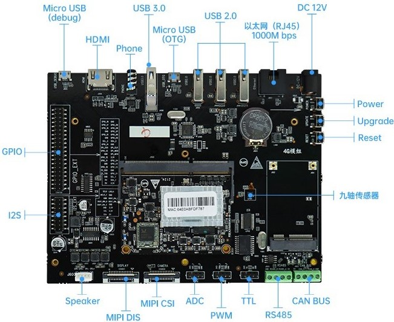

# 【九联Unionpi-Tiger开发套件】

**简介**

九联科技Unionpi Tiger(A311D)是一款应用于图像处理，音视频处理和深度学习等的智能硬件。其芯片拥有强大的CPU、GPU和神经网络加速子系统。支持4K视频编解码器引擎和一流的HDR图像处理，集成了所有标准音频/视频输入/输出接口。主系统CPU采用大小核设计，主频高达2.2GHz，集成了四个Cortex-A73核心和两Cortex-A53核心 ，集成独立的5.0T NPU处理器。

图1：九联Unionpi-Tiger开发板外观图

**一、开发板详情**

A311D采用四个Cortex-A73，主频最高为2.2GHz的大核和两个Cortex-A53，主频最高为1.8GHz的小核组成；采用22nm先进工艺，具有低功耗高性能的特点，可广泛应用于嵌入式人工智能领域。

其规格参数如下：

|规格类型|具体参数|
|:-|:-:|
|主芯片|A311D|
|CPU|4 x Cortex-A73+2 x Cortex-A53|
|GPU|ARM Mali-G52 4核GPU|
|NPU|内置神经网处理器 NPU，AI 运算性能强：支持 8bit/16bit 运算，运算性能高达 5.0TOPS|
|VPU|支持4K VP9，H265，H264视频解码，高达60fps；支持多路1080P 多格式解码（H265，H264，MPEG-1/2/4，VP9，WMV）；一路1080P@60fps H264,H265编码；一路JPEG编码|
|内存|LPDDR4x 4GB|
|存储|高速 eMMC 5.1 32GB|
|显示|1 x HDMI 2.0 , 支持 4K@60HZ 输出 和 HDCP 1.4/2.2；1 x MIPI-DSI , 支持单通道1080P@60fps 输出|
|音频|1 x HDMI 2.0 音频输出；1 xSpeaker 双声道（4Ω/5W）；1 x 四段式CTIA耳麦，支持麦克风音频输入|
|摄像头|1 x 2-lane MIPI-CSI 摄像头接口|
|拓展接口|RS485 x 1、CAN Bus x 1、ADC x 1、PWM x 1、TTL x 1、GPIO|
|电源|DC 12V/3A|
|工作温度|0℃ - 60℃|

**二、开发板功能**

· 核心板: 采用DDR3 SODIMM接口，尺寸为67.6mm x 52.3mm x 5mm，可满足小型终端产品空间需求

· 千兆网口：可通过千兆以太网网口(RJ45)访问和传输内外网数据，提高网络传输效率

· 内置神经网处理器 NPU:  AI 运算支持 8bit/16bit 运算，运算性能高达5.0TOPS,支持主流神经网络模型（Caffe/MXNet/TensorFlow/TF-lite/ONNX/Darknet等）

·视频处理器VPU：支持4K VP9，H265，H264视频解码，高达60fps，支持多路1080P 多格式解码（H265，H264，MPEG-1/2/4，VP9，WMV）， 一路1080P@60fps H264,H265编码，  一路JPEG编码

· 支持多系统：OpenHarmony、Ubuntu 18.04、 Linux、Android

**三、开发板配件安装：**

**配件摄像头（MIPI-CSI）、屏幕模组（MIPI-DSI）及喇叭安装如下图：**

**四、开发板应用场景**

九联Unionpi Tiger(A311D)有着强大的芯片及大量丰富的硬件接口，使得它能应用于多种领域。适用于智能家居、云终端、工业控制、信息发布终端、多媒体处理、AI边缘计算、物联网、舵机应用等各种领域。

**五、快速入门指南参考**

**[环境搭建](../docs/环境搭建.md)**

**[获取源码](../docs/获取源码.md)**

**[编写helloworld](../docs/编写helloworld.md)**

**[源码编译](../docs/源码编译.md)**

**[镜像烧录](../docs/镜像烧录.md)**

**[运行镜像](../docs/运行镜像.md)**

**六、联系购买**

合作伙伴购买链接，如开发学习过程中遇到问题可联系客服，加入技术交流群：

https://item.taobao.com/item.htm?id=656218662088
