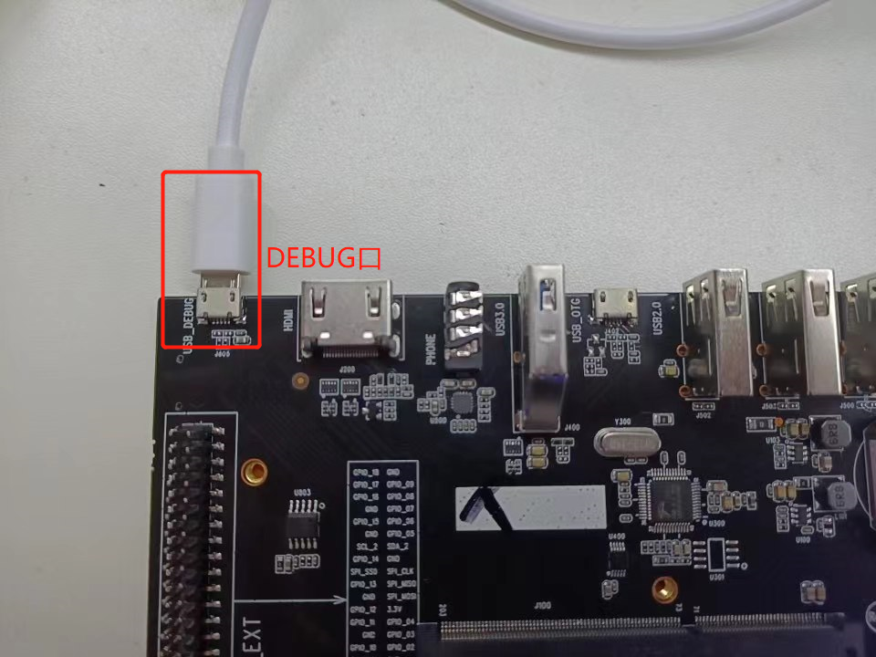
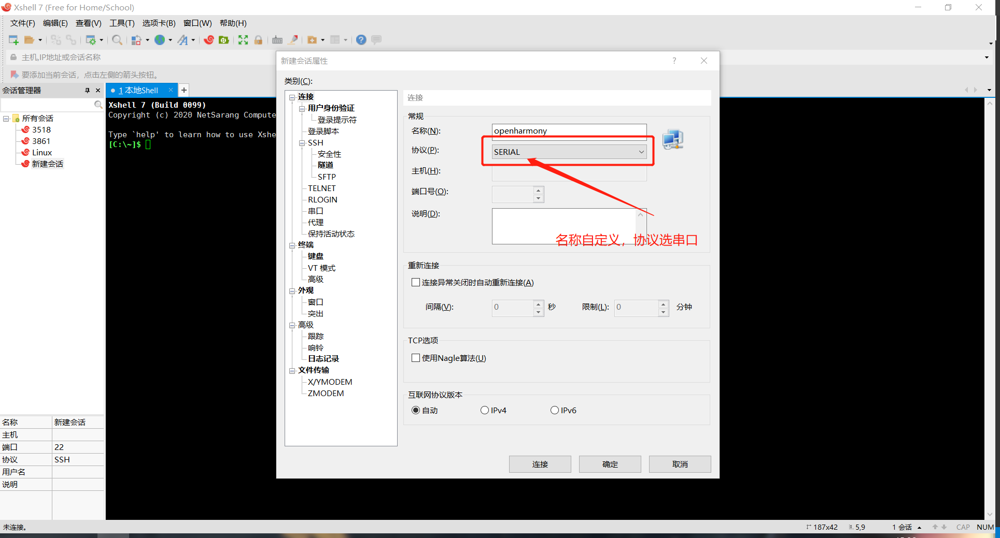
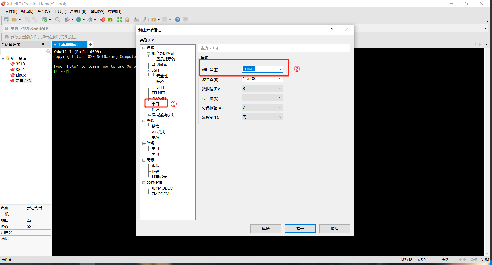
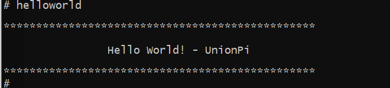

### 开发板连接PC
PC在windows环境下，使用Micro USB数据线连接PC与开发板DEBUG口，然后接通电源。如图所示。


### 打开串口工具
这里用的xshell串口工具来演示（其他串口工具也可），进入后，Alt+N，新建会话，名称自定义，协议选串口。如图所示。
  
跳转到串口配置，选择端口号，根据自己的选择，如果不清楚，可以打开设备管理器去看COM。选择好之后，直接点击连接即可。
  

### 运行界面
系统运行成功后，串口输入：
```
helloworld
```
系统输出打印，如图所示。
 

连接mipi屏的话，mipi屏也有画面，如图所示：
 
