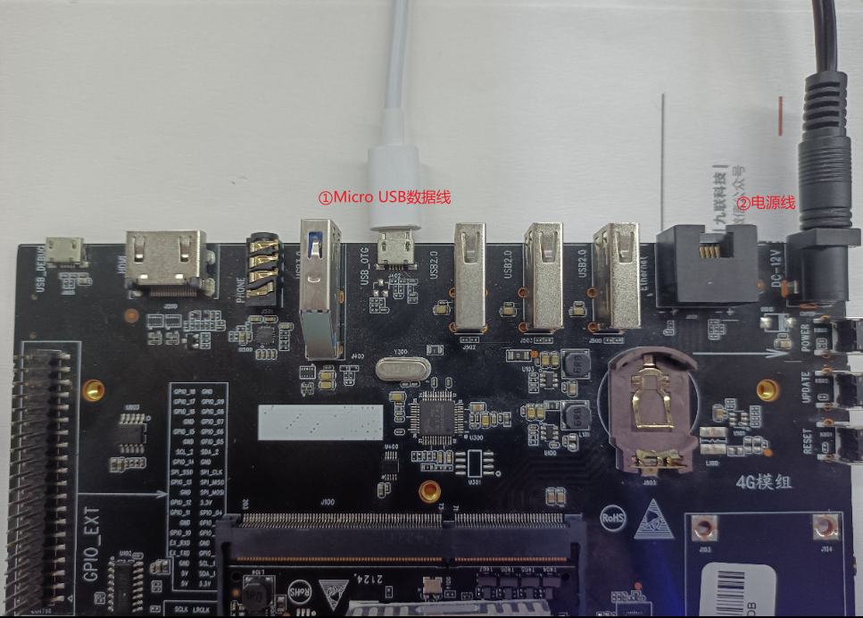
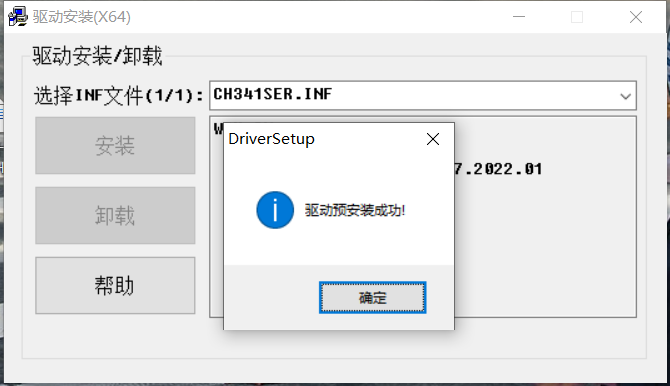
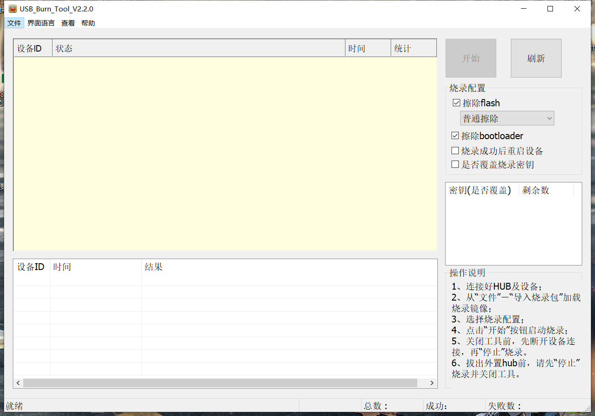
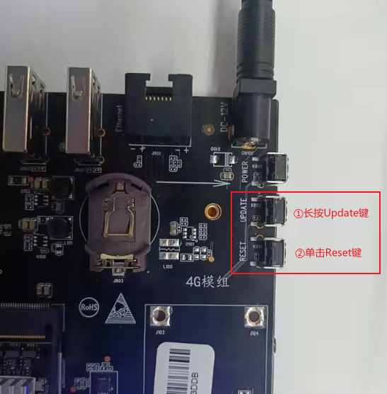
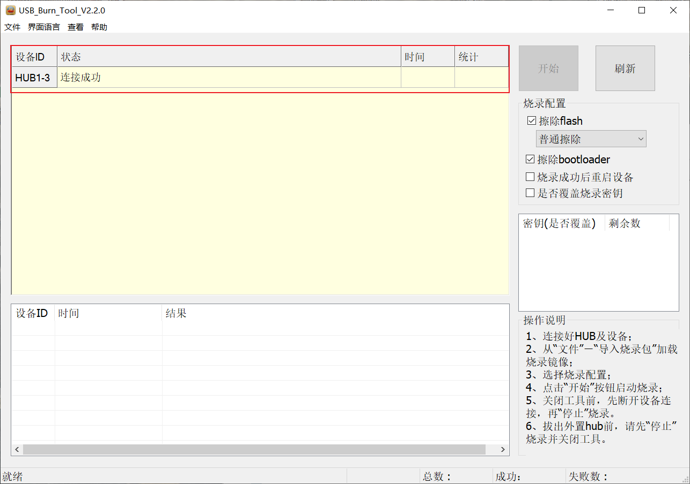
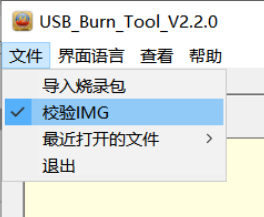
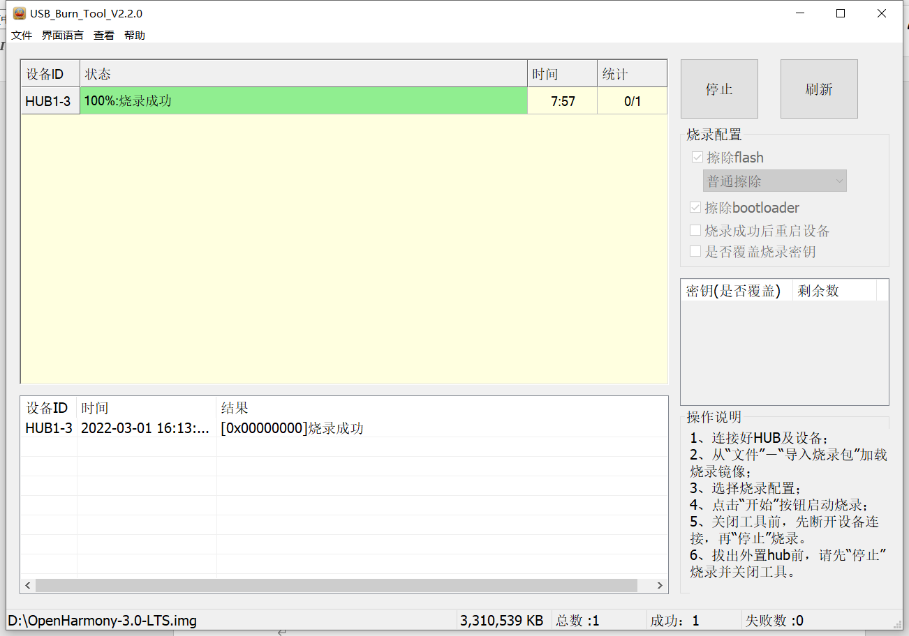

### 开发板接线连接PC
PC在windows环境下，使用Micro USB数据线连接PC与开发板OTG口，然后接通电源。如图所示。

### 安装USB串口驱动
在网上下载串口驱动，支持CH340G即可，[下载地址](http://www.wch.cn/downloads/CH341SER_EXE.html)  
驱动下载完成后，直接打开安装即可。

### 准备烧录工具
在网上下载烧录工具usb_burning_tool，[下载地址](http://www.unionman.com.cn/uploads/soft/20220530/1653887506.zip) 

### 进入升级界面
使开发板进入烧录模式，在接入电源上电状态后，长按Update键不放开，单击Reset键，按键位置如图所示。

开发板进入烧录模式，串口线正确接入，被识别之后，打开烧录工具USB_Burning_Tool后显示已连接成功，如图所示，则可以进行烧录。

### 开始烧录
从菜单“文件”－“导入烧录包”选择加载要烧录的镜像文件，也可以通过“最近打开的文件”选择最近使用过的烧录镜像文件，其中默认对导入的烧录包进行校验检查（不需要校验可去除）。

导入烧录包（为上文linux环境下编译打包出来的固件镜像），点击“开始”，接着就可以等待镜像烧录。烧录完成之后，如果成功“状态”列则显示浅绿色，如果失败则显示红色。本次烧录成功如图所示。（烧录时间根据镜像大小而定，烧录大概7-10分钟左右，耐心等待）
