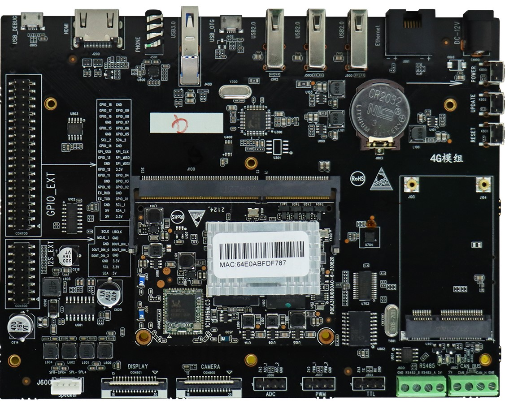
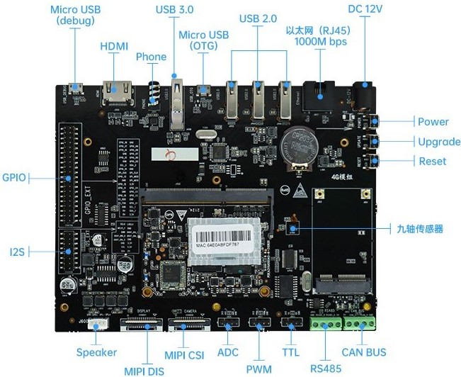
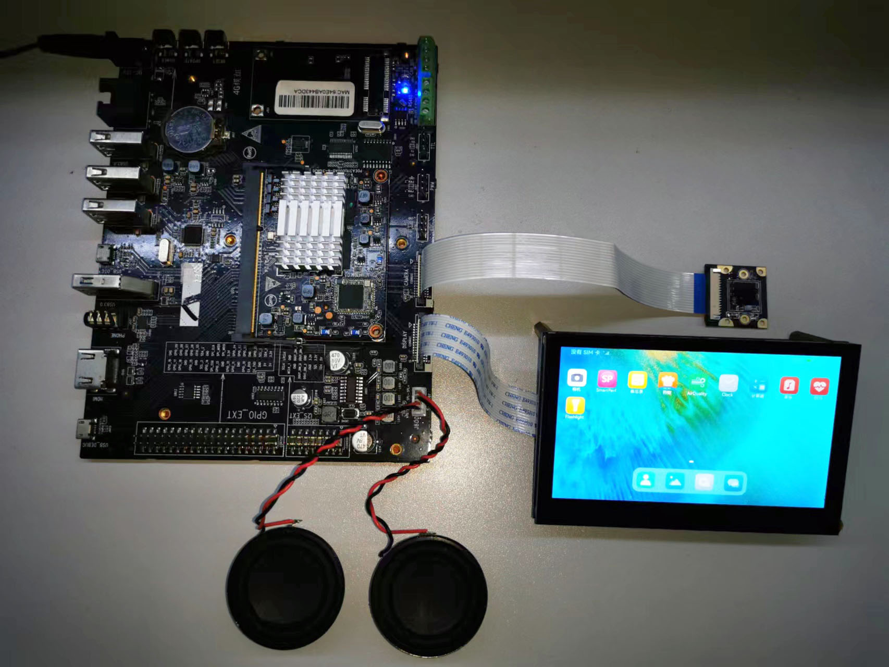
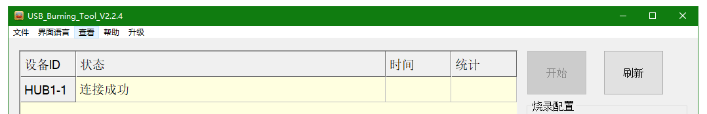
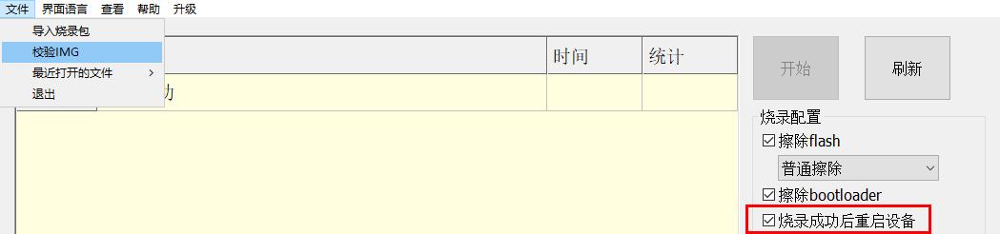
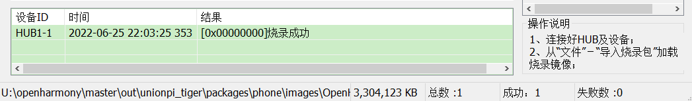
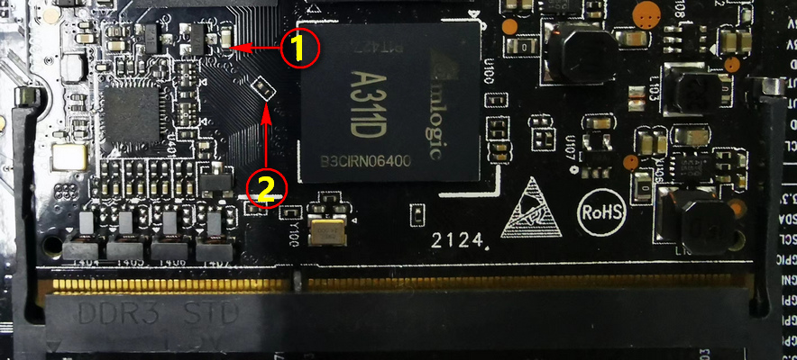

# 九联Unionpi-Tiger开发套件

## 介绍

九联科技Unionpi Tiger是一款应用于图像处理，音视频处理和深度学习等场景的智能硬件，其主芯片采用Amlogic A311D芯片方案。
A311D支持GPU和神经网络加速子系统，支持4K视频编解码器引擎和一流的HDR图像处理，并集成了所有标准音频/视频输入/输出接口。主系统的CPU采用大小核设计，主频高达2.2GHz，集成了四个Cortex-A73核心和两Cortex-A53核心 ，集成独立的5.0T NPU处理器。

图1 九联Unionpi-Tiger开发板外观图



## 开发板详情

A311D采用四个Cortex-A73，主频最高为2.2GHz的大核和两个Cortex-A53，主频最高为1.8GHz的小核组成；采用22nm先进工艺，具有低功耗高性能的特点，可广泛应用于嵌入式人工智能领域。

其规格参数如下：

| 规格类型 | 具体参数                                                                                                            |
| ---- | --------------------------------------------------------------------------------------------------------------- |
| 主芯片  | Amlogic A311D                                                                                                   |
| CPU  | 4 x Cortex-A73+2 x Cortex-A53                                                                                   |
| GPU  | ARM Mali-G52 4核GPU                                                                                              |
| NPU  | 内置神经网处理器 NPU，AI 运算性能强：支持 8bit/16bit 运算，运算性能高达 5.0TOPS                                                           |
| VPU  | 支持4K VP9，H265，H264视频解码，高达60fps；支持多路1080P 多格式解码（H265，H264，MPEG-1/2/4，VP9，WMV）；一路1080P@60fps H264,H265编码；一路JPEG编码 |
| 内存   | LPDDR4x 4GB                                                                                                     |
| 存储   | 高速 eMMC 5.1 32GB                                                                                                |
| 显示   | 1 x HDMI 2.0 , 支持 4K@60HZ 输出 和 HDCP 1.4/2.2；1 x MIPI-DSI , 支持单通道1080P@60fps 输出                                  |
| 音频   | 1 x HDMI 2.0 音频输出；1 xSpeaker 双声道（4Ω/5W）；1 x 四段式CTIA耳麦，支持麦克风音频输入                                                 |
| 摄像头  | 1 x 2-lane MIPI-CSI 摄像头接口                                                                                       |
| 拓展接口 | RS485 x 1、CAN Bus x 1、ADC x 1、PWM x 1、TTL x 1、GPIO                                                              |
| 电源   | DC 12V/3A                                                                                                       |
| 工作温度 | 0℃ - 60℃                                                                                                        |

图2 开发板接口示意图


## 开发板功能

- 核心板: 采用DDR3 SODIMM接口，尺寸为67.6mm x 52.3mm x 5mm，可满足小型终端产品空间需求

- 千兆网口：可通过千兆以太网网口(RJ45)访问和传输内外网数据，提高网络传输效率

- 内置神经网处理器 NPU:  AI 运算支持 8bit/16bit 运算，运算性能高达5.0TOPS,支持主流神经网络模型（Caffe/MXNet/TensorFlow/TF-lite/ONNX/Darknet等）

- 视频处理器VPU：支持4K VP9，H265，H264视频解码，高达60fps，支持多路1080P 多格式解码（H265，H264，MPEG-1/2/4，VP9，WMV）， 一路1080P@60fps H264,H265编码，  一路JPEG编码

- 支持多系统：OpenHarmony、OpenEuler、Ubuntu 20.04、 Linux、Android

## 开发板配件安装

配件摄像头（MIPI-CSI）、屏幕模组（MIPI-DSI）及喇叭安装如下图：

图3 开发板配件连接


## 开发板应用场景

九联Unionpi Tiger(A311D)有着强大的芯片处理能力及大量丰富的硬件接口，使得它能应用于多种领域。适用于智能家居、AI人脸识别、工业控制、智慧车载、多媒体处理、AI边缘计算、物联网、舵机应用等各种领域。

## 搭建开发环境

#### 1、安装依赖工具

安装命令如下：

```shell
sudo apt-get update && sudo apt-get install binutils git git-lfs gnupg flex
bison gperf build-essential zip curl zlib1g-dev gcc-multilib g++-multilib
libc6-dev-i386 lib32ncurses5-dev x11proto-core-dev libx11-dev lib32z1-dev ccache
libgl1-mesa-dev libxml2-utils xsltproc unzip m4 bc gnutls-bin python3.8
python3-pip ruby
```

**说明：** 
以上安装命令适用于Ubuntu 18.04/20.04，其他版本请根据安装包名称采用对应的安装命令。

#### 2、获取标准系统源码

**前提条件**

1）注册码云gitee账号。

2）注册码云SSH公钥，请参考[码云帮助中心](https://gitee.com/help/articles/4191)。

3）安装[git客户端](http://git-scm.com/book/zh/v2/%E8%B5%B7%E6%AD%A5-%E5%AE%89%E8%A3%85-Git)和[git-lfs](https://gitee.com/vcs-all-in-one/git-lfs?_from=gitee_search#downloading)并配置用户信息。

```shell
git config --global user.name "yourname"
git config --global user.email "your-email-address"
git config --global credential.helper store
```

4）安装码云repo工具，可以执行如下命令。

```shell
curl -s https://gitee.com/oschina/repo/raw/fork_flow/repo-py3 
/usr/local/bin/repo  #如果没有权限，可下载至其他目录，并将其配置到环境变量中
chmod a+x /usr/local/bin/repo
pip3 install -i https://repo.huaweicloud.com/repository/pypi/simple requests
```

**获取源码操作步骤**

1） 通过repo + ssh 下载（需注册公钥，请参考码云帮助中心）：

```shell
repo init -u git@gitee.com:openharmony/manifest.git -b master --no-repo-verify
repo sync -c
repo forall -c 'git lfs pull'
```

2） 通过repo + https 下载：

```shell
repo init -u https://gitee.com/openharmony/manifest.git -b master --no-repo-verify
repo sync -c
repo forall -c 'git lfs pull'
```

**执行prebuilts**

在源码根目录下执行脚本，安装编译器及二进制工具：

```shell
bash build/prebuilts_download.sh
```

下载的prebuilts二进制默认存放在与OpenHarmony同目录下的OpenHarmony_2.0_canary_prebuilts下。

## 编译与调试

#### 1、编译及打包

在Linux环境进行如下操作:

1） 进入源码根目录，执行如下命令进行版本编译：

```shell
./build.sh --product-name unionpi_tiger –ccache
```

2） 检查编译结果。编译完成后，log中显示如下：

```
[OHOS INFO] unionpi_tiger build success
[OHOS INFO] cost time: 0:14:30
=====build successful=====
2022-06-25 14:30:14
```

编译所生成的文件都归档在out/unionpi_tiger/目录下，结果镜像输出在
out/unionpi_tiger/packages/phone/images/ 目录下。

3） 编译源码完成，如果需要生成boot.img镜像或需要完整USB烧录镜像包，请先进行镜像打包，打包命令如下：

```shell
./device/board/unionman/unionpi_tiger/common/tools/packer-unionpi.sh
```

打包完成后的镜像名称为OpenHarmony.img, 也生成在out/unionpi_tiger/packages/phone/images/ 目录下：

> 1.该步骤每次编译完成后执行一次即可；
> 
> 2.Amlogic USB烧录工具不支持单镜像烧录，需要对镜像进行打包，如果单独烧写镜像可以在Uboot下采用U盘升级的方式

#### 2、烧录步骤

1） 开发板与PC连接USB OTG口

2） 进入烧录模式

在接入电源上电状态前，长按Update键不放开可以进入烧录模式。如果开发板，已经处于开机上电的情况下，长按Update键，再单击Reset键进入烧录模式。USB烧录工具显示设备连接状态如下图所示：



3）烧录配置及镜像选择

从菜单“文件”－“导入烧录包”选择加载要烧录的镜像文件，也可以通过“最近打开的文件”选择最近使用过的烧录镜像文件，其中默认对导入的烧录包进行校验检查（可去除校验，以加快烧录进度）



导入烧录包（为上文linux环境下编译打包出来的固件镜像），点击“开始”，接着就可以等待镜像烧录。烧录完成之后，如果软件界面会相应提示成功或失败，失败同时会提示失败原因。本次烧录成功如图所示。（烧录时间根据镜像大小而定，烧录大概10-12分钟左右，耐心等待, 如果调整镜像大小或采用sparse-image，可以缩短烧录时间）



烧写工具下载及使用

> 1、工具下载参考：[USB烧录工具及USB转串口工具](https://gitee.com/algoideas/amlogic-tools/tree/master/Windows)
> 
> 2、USB OTG口同时为HDC调试接口，需注意右侧3个USB2.0接口和USB OTG口不能同时启用。

## 其他

#### 1、命令行烧录

开发板支持命令行烧录功能，且命令行烧录支持单分区进行更新，工具链接：[update.zip](https://gitee.com/algoideas/amlogic-tools/blob/master/Windows/update.zip)。其中，命令行的详细使用方法可直接输入update.exe进行了解。命令行烧录的使用方法和步骤如下：

##### 1.1、 进入升级模式

**a)**、自动进入方式 (目前仅适用master分支的版本)
系统正常启动后，并确保可以正常使用hdc工具的情况下，执行以下命令后自动重启进入升级模式：

```
hdc_std shell aml_reboot update
```

**b)**、手动进入方式 (参考编译与调试章节说明)
开机前，按Update键，可进入升级模式

##### 1.2、镜像烧录

烧录完整分区镜像命令如下(可根据需要仅对单独分区进行升级)：

```
update.exe partition _aml_dtb dtb.img
update.exe partition boot boot.img
update.exe partition updater updater.img
update.exe partition data userdata.img
update.exe partition vendor vendor.img
update.exe partition system system.img
update.exe partition bootloader u-boot.bin
update.exe bulkcmd "env default -a"
update.exe bulkcmd "env save"
update.exe bulkcmd reboot
```

#### 2、切换USB Host模式

USB OTG口默认HDC调试，其他3个USB2.0口不能使用，如果需要使用USB2.0,需要进行切换（或通过修改dts默认启用USB2.0），切换命令如下：

```
# 同时切换USB HUB (启用ttyACM0 ttyACM1)
echo 1 > /sys/devices/platform/leds/leds/usb_switch/brightness
echo 0 > /sys/devices/platform/soc/ffe09000.usb/usb_mode
echo host > /sys/class/usb_role/ffe09000.usb-role-switch/role
```

#### 3、恢复模式

开发板如果不能正常启动时，即Boot启动异常（可通过debug串口查看），且Update键进入烧录模式，USB烧录软件不能识别设备。

如下图所示，用金属短接核心板触点1和2，可以进入恢复模式，USB烧录软件可以正常识别设备后，按照正常烧录步骤烧写即可。


